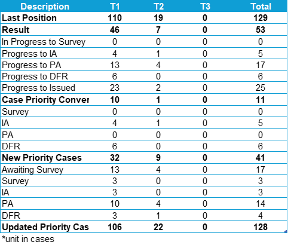
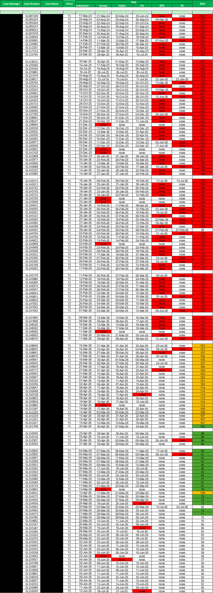
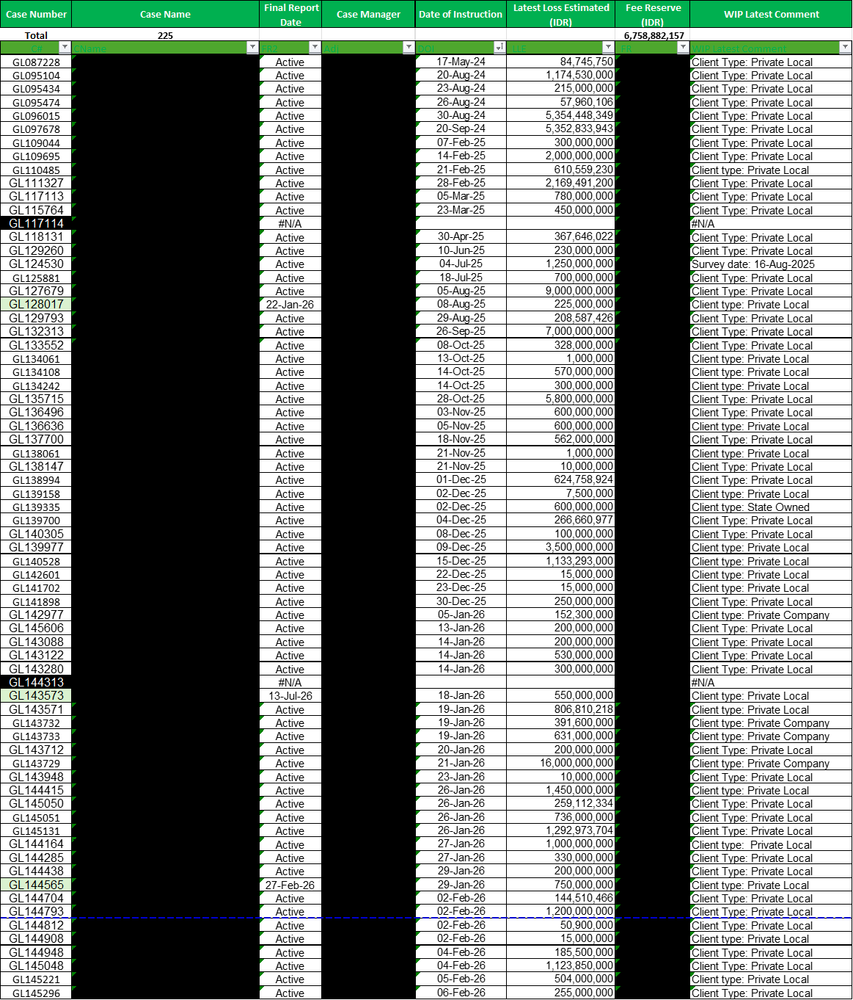
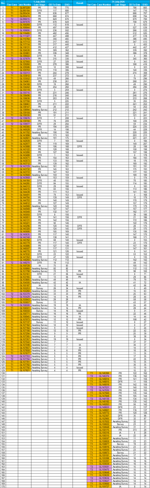
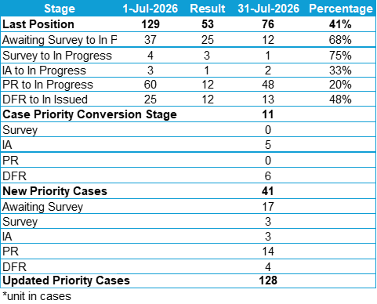

# 📈 Claims DSO Analytics Dashboard

> An automated Microsoft Excel dashboard for monitoring Days Sales Outstanding (DSO), tracking operational KPIs, and analyzing claims processing performance.

---

## 📌 Overview

The **Claims DSO Analytics Dashboard** is an operational reporting solution developed using Microsoft Excel to monitor and analyze the performance of insurance claim handling.

The dashboard enables claim managers and management teams to monitor outstanding cases, analyze Days Sales Outstanding (DSO), evaluate workflow performance, and measure operational efficiency through automated reporting.

> **Note:** All confidential business information has been removed or anonymized for portfolio purposes.

---

# 🎯 Business Problem

Managing hundreds of active claim files manually makes it difficult to:

- Monitor Days Sales Outstanding (DSO)
- Track claim progress across workflow stages
- Identify overdue cases
- Measure operational performance
- Monitor workload distribution
- Produce management reports efficiently

Without a centralized monitoring system, operational performance becomes difficult to evaluate and decision-making is delayed.

---

# 💡 Solution

Developed an automated Microsoft Excel dashboard that integrates operational claim data into a centralized monitoring system.

The dashboard provides:

- DSO analysis
- Outstanding claim monitoring
- Workflow stage tracking
- Tier-based workload analysis
- Operational KPI reporting
- Executive performance reporting

---

# ✨ Key Features

### 📊 DSO Monitoring

- Days Sales Outstanding (DSO) calculation
- Outstanding case monitoring
- Overdue case identification
- Conditional formatting for SLA monitoring

### 📋 Claims Workflow Monitoring

- Claim lifecycle tracking
- Workflow stage analysis
- Operational progress monitoring
- Performance comparison

### 📈 Operational Reporting

- Tier distribution analysis
- Workflow performance summary
- Executive operational reporting
- KPI monitoring

---

# 📷 Dashboard Preview

## Claims Distribution by Tier

Displays the distribution of claims across Tier 1, Tier 2, and Tier 3, providing an overview of workload allocation.

---

## DSO Analysis Dashboard

Monitors claim progress throughout the workflow while calculating Days Sales Outstanding (DSO) and highlighting overdue cases using conditional formatting.

---

## Claims Case Management

Centralized operational claim database used as the primary source for DSO analysis and management reporting.

---

## DSO Comparison Dashboard

Compares outstanding claims and DSO status between two reporting periods to evaluate operational improvements.

---

## Workflow Stage Performance Summary

Compares workflow stages between the beginning and end of the reporting period, measuring operational progress and process efficiency.

---

# 💼 Business Value

This dashboard helps management to:

- Monitor outstanding claims
- Reduce Days Sales Outstanding (DSO)
- Improve operational efficiency
- Prioritize overdue cases
- Measure workflow performance
- Support data-driven decision-making
- Standardize operational reporting

---

# 🛠 Technologies Used

- Microsoft Excel
- Advanced Excel Formulas
- Conditional Formatting
- Dashboard Design
- Data Analysis
- Operational Reporting
- KPI Monitoring

---

# 💡 Skills Demonstrated

- Data Analysis
- Business Intelligence
- Dashboard Development
- KPI Development
- Operational Analytics
- Reporting Automation
- Microsoft Excel
- Process Improvement
- Claims Management

---

# 🚀 Future Improvements

Potential enhancements include:

- SQL database integration
- Power BI dashboard migration
- Python-based automation
- Streamlit web dashboard
- Automated email notifications
- Interactive KPI reporting
- Predictive DSO analytics

---

# 📄 Disclaimer

This repository is intended for educational and portfolio purposes only.

All company names, claim numbers, customer information, financial values, and other confidential business data have been removed or anonymized.

---

# 👨‍💻 Author

**Ahmad Subari**

Marine Cargo Surveyor | Claims Analyst | Data Analytics Enthusiast

- 💼 LinkedIn: https://www.linkedin.com/in/ahmadsubari23
- 💻 GitHub: https://github.com/ahmadsubari23

---

⭐ If you found this project useful, please consider giving it a star.
